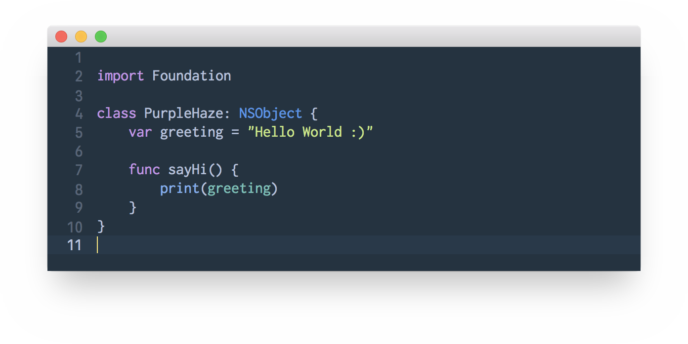

# PurpleHaze



## Installation

1. Clone PurpleHaze:
```bash
$ git clone https://github.com/IsaacXen/PurpleHaze.git
```
2. Create Xcode themes folder:
```bash
$ mkdir ~/Library/Developer/Xcode/UserData/FontAndColorThemes/
```
3. Copy PurpleHaze to themes folder:
```bash
$ cp PurpleHaze.xccolortheme ~/Library/Developer/Xcode/UserData/FontAndColorThemes/PurpleHaze.xccolortheme
```
4. Relaunch Xcode and change Theme to `PurpleHaze` in Xcode Preferences - Font & Colors
